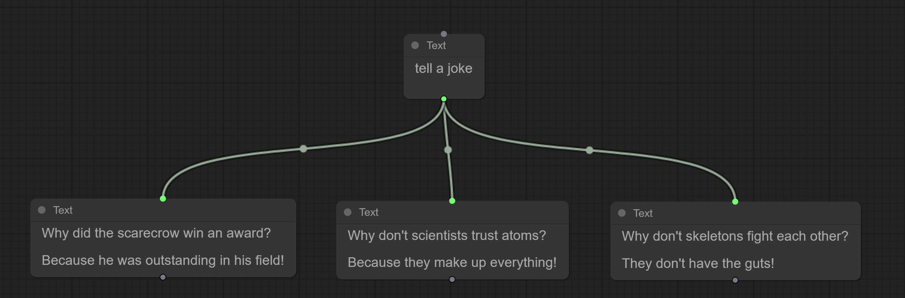
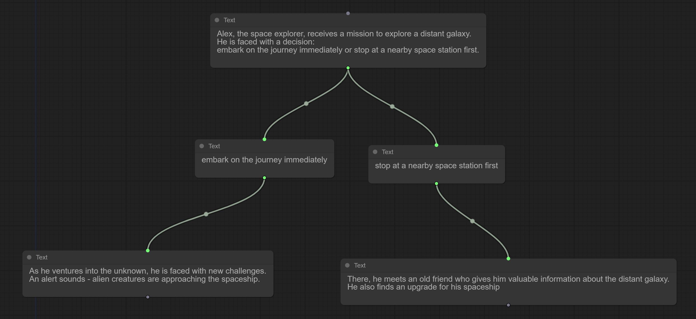

# ChatNode

## Overview

ChatNode is an innovative project that allows users to visually interact with a node-based interface, where each node can be associated with a message from ChatGPT, an advanced language model developed by OpenAI. The project leverages the power of litegraph.js to create a user-friendly and interactive interface for visualizing and manipulating chat data.

## Capabilities of ChatNode
1. **Generation of Multiple Messages from a Single Node**  
A node can have multiple child nodes, each of which can be linked with a separate message generated by ChatGPT. This functionality enables users to generate a series of messages from a single node and visualize the interconnection between these messages. This is equivalent to engaging with ChatGPT multiple times within the same context.  

2. **Assistance in Developing a Branching Story**  
A branching story, characterized by multiple endings, can be represented as a tree structure where each leaf node corresponds to a unique ending. Each leaf node, along with its ancestors, forms a distinct storyline. ChatNode enables users to visualize this story structure and generate content for each node. The content for each node can be generated by ChatGPT, manually written by the user, or a combination of both. This functionality provides users with an intuitive approach to developing a branching story.  

